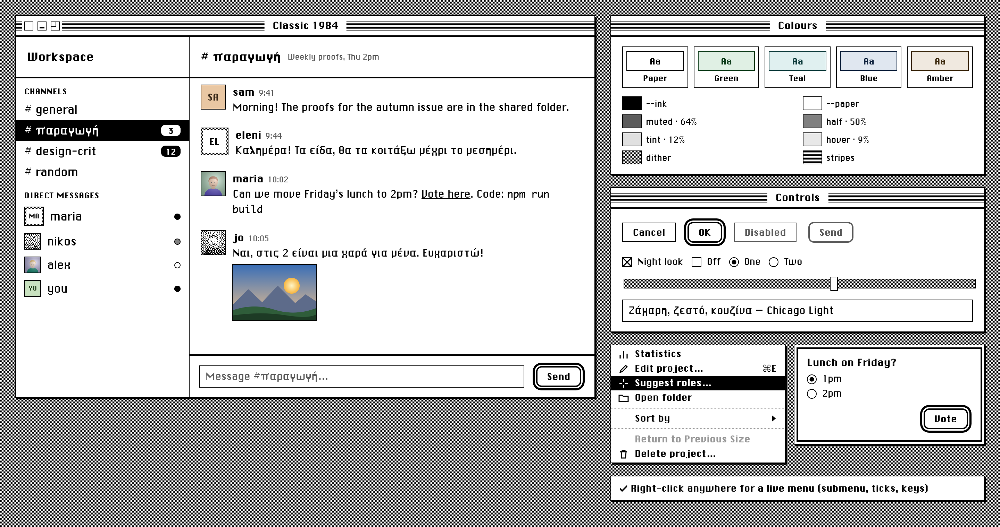
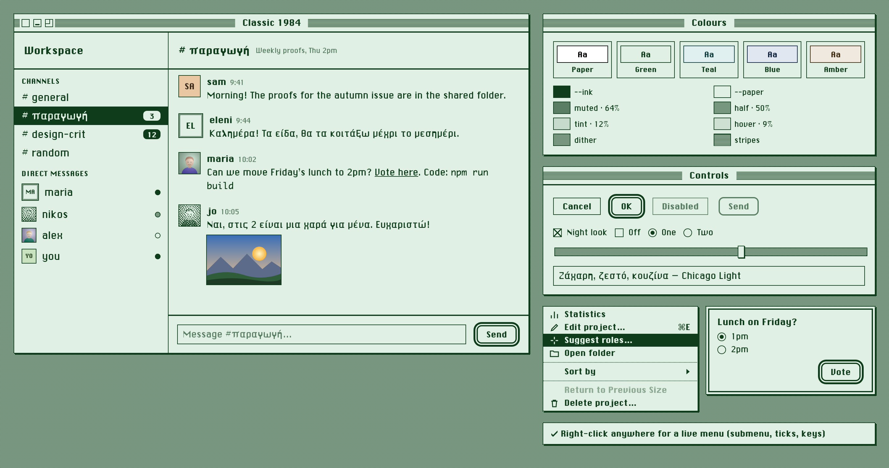
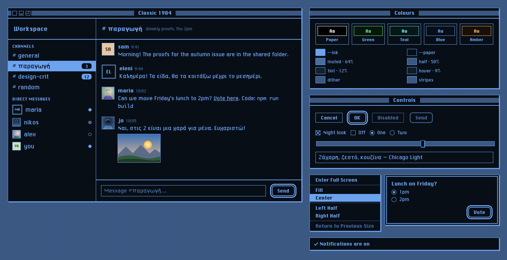
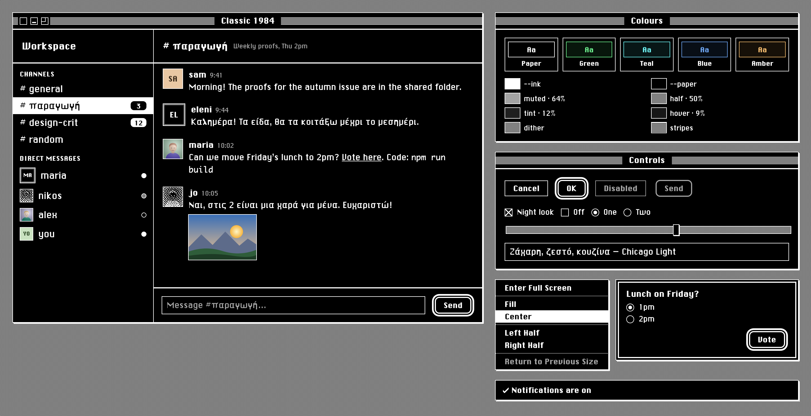
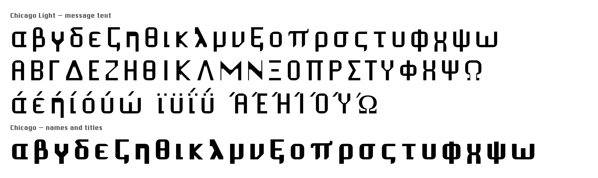
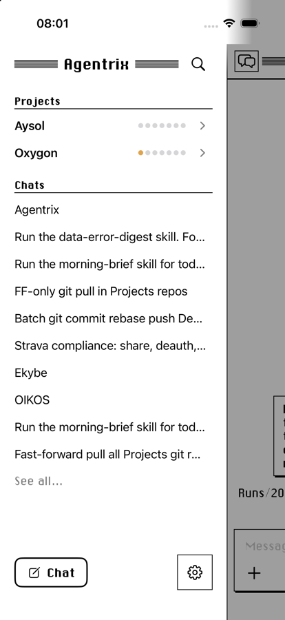
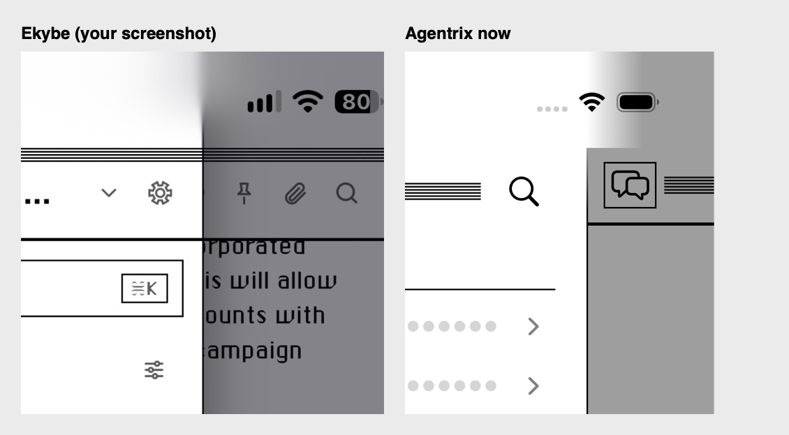
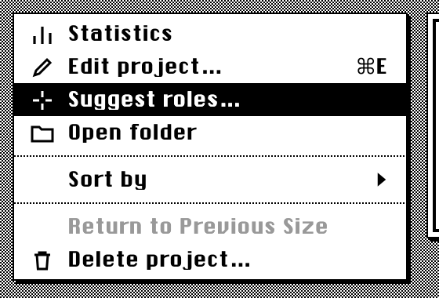
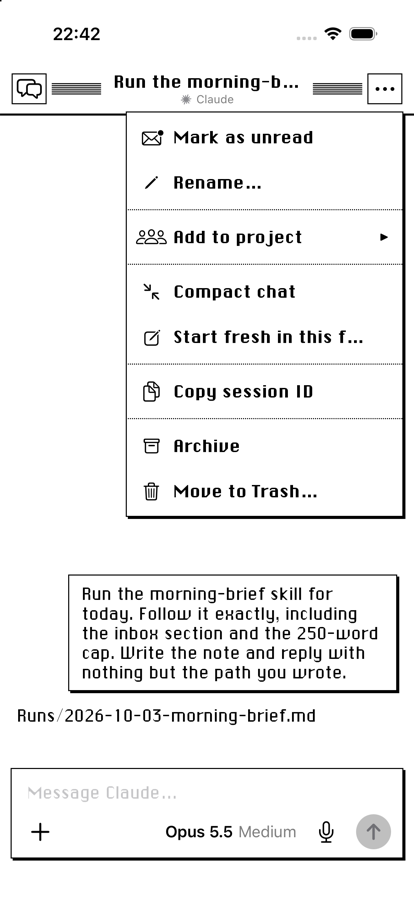
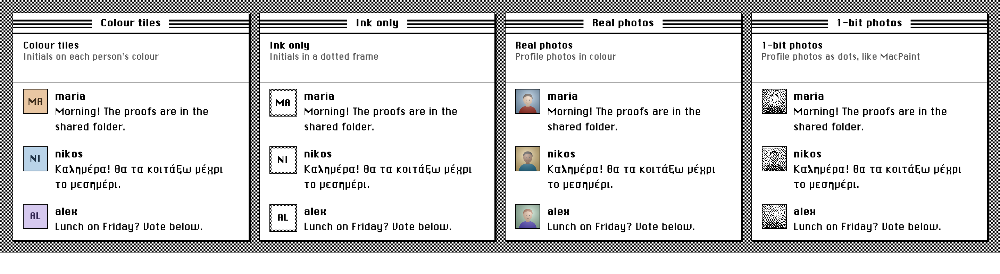

# Classic 1984 — design system

The look of the 1984 Macintosh, rebuilt for modern apps. It started in Agentrix (Classic theme, renderer/classic.css and ios/AgentDeck/Classic.swift). Ekybe then took it further: the Mac window chrome, people's pictures, Greek text, per-device settings and a text size setting. This repository is the reference for copying it into any other app: the rules, a drop-in stylesheet and script, the fonts with full Greek, and a live example.

**Live:** [justaicode.app/classic-1984](https://justaicode.app/classic-1984/) · [example page](https://justaicode.app/classic-1984/specimen.html) · [picture styles](https://justaicode.app/classic-1984/pictures.html)

| | |
|---|---|
| **Status** | Live in Ekybe (web, Mac, iPhone, Android) and Agentrix (Mac, iPhone), October 2026 |
| **Approved by** | Roberto, from mockups, 3 and 4 Oct 2026 |
| **Reference implementations** | Ekybe (`src/classic.css`, `src/lib/classic.ts`, `src/components/ClassicTitleBar.tsx`, `src/components/Avatar.tsx`) and Agentrix (`renderer/classic.css`, `ios/AgentDeck/Classic.swift`); both private |
| **This repository** | `classic-1984.css`, `classic-1984.js`, `fonts/`, `specimen.html`, `pictures.html`, `tools/`, `images/` |
| **Licence** | Code and documentation MIT; fonts public domain (see `LICENSE` and §17) |



---

## Contents

1. [Principles](#1-principles)
2. [Quick start](#2-quick-start)
3. [Colour](#3-colour)
4. [Patterns](#4-patterns)
5. [Typography](#5-typography)
6. [Shape, lines and elevation](#6-shape-lines-and-elevation)
7. [Layout and metrics](#7-layout-and-metrics)
8. [Components](#8-components)
9. [People's pictures](#9-peoples-pictures)
10. [Interaction and motion](#10-interaction-and-motion)
11. [Settings a person can change](#11-settings-a-person-can-change)
12. [Platforms](#12-platforms)
13. [Re-skinning an existing app](#13-re-skinning-an-existing-app)
14. [Accessibility](#14-accessibility)
15. [Do and don't](#15-do-and-dont)
16. [Checklist](#16-checklist)
17. [Fonts: origin, licence, rebuilding](#17-fonts-origin-licence-rebuilding)
18. [Decision log](#18-decision-log)
19. [Files](#19-files)

---

## 1. Principles

The 1984 Mac had a 1-bit screen, 512 × 342 pixels, black or white per pixel. Everything in this system follows from that limit. It is applied with judgement, not literally.

1. **Two colours.** There is an ink and a paper, and nothing else. By default they are black and white. A person may tint them (dark green on pale green, for example), but there are still only two. Every grey, highlight and border is the ink, the paper, or a mix of them.
2. **Grey is a pattern.** Where a modern UI uses a grey fill, 1984 used a dither: alternating ink and paper pixels. Use the dither for tracks, the desktop and frames, never a flat grey fill. Text that has to be secondary is the one exception: it uses a 64% ink mix, because dithered text cannot be read.
3. **Square corners, hard shadows.** Corners are square. Shadows are a solid 2px step down and to the right, with no blur. The few round things are listed in §6 and are deliberate.
4. **Lines are 1px. The line under a title is 2px.** That is the whole hierarchy of lines.
5. **Selection is reversal.** A chosen row, a hovered menu item, a pressed button all swap ink and paper. Nothing gets a colour to show it is selected.
6. **Chicago speaks.** Names, titles, buttons, menus and labels are set in Chicago. Running text is set in Chicago Light, a thinned Chicago that can be read for long stretches.
7. **Colour is content, never chrome.** Emoji, photos and pictures people post keep their colour. The interface never adds any.
8. **No motion.** Things appear and disappear. Nothing fades, slides or bounces.
9. **Modern where it matters.** Text can be resized, Greek is fully supported, and the night look follows the system's dark mode. Focus is visible. Authenticity never outranks reading.

---

## 2. Quick start

1. Copy `classic-1984.css`, `classic-1984.js` and `fonts/` into your app, or add this repository as a git submodule:

   ```sh
   git submodule add https://github.com/justaicode/classic-1984.git design/classic-1984
   ```

    Keep the relative path `fonts/` next to the CSS, or edit the two `@font-face` URLs.
2. Add `class="c84"` to `<html>`. Any container works too, if only part of the app should be in the style.
3. Set the colours:

   ```js
   import { followSystem } from './classic-1984.js'
   // prefs: { hue, strength, night, avatars } — see §3 and §11
   const stop = followSystem(document.documentElement, () => prefs)
   ```

   If you skip this step, the CSS defaults are black on white, day only.
4. Build with the `c84-*` classes in §8. Open `specimen.html` to see every one of them. Serve the folder (`python3 -m http.server` in it), because fonts and 1-bit photos need same-origin.

A bare window:

```html
<div class="c84-window">
  <div class="c84-window-bar">
    <button class="c84-box is-close" aria-label="Close"></button>
    <button class="c84-box is-mini" aria-label="Minimise"></button>
    <button class="c84-box is-zoom" aria-label="Zoom"></button>
    <span class="c84-window-title">Untitled</span>
  </div>
  <div class="c84-pane-bar is-plain">Inbox</div>
  <div class="c84-row is-selected">First item <span class="c84-badge">3</span></div>
  <div class="c84-row">Second item</div>
</div>
```

---

## 3. Colour

### 3.1 The two colours

| Token | Meaning |
|---|---|
| `--ink` | Text, lines, fills that mean "on", the selected row's background |
| `--paper` | Backgrounds, text on an ink fill, the inside of boxes |

Everything else in the system is derived from these two.

### 3.2 Derived tokens

| Token | Value | Used for |
|---|---|---|
| `--c84-muted` | 64% ink in paper | Timestamps, hints, placeholders, disabled labels |
| `--c84-half` | 50% ink in paper | The "away" presence dot |
| `--c84-tint` | 12% ink in paper | A soft accent fill (a mention, a highlighted message) |
| `--c84-hover` | 9% ink in paper | A row under the pointer |
| `--c84-dither` | 2 × 2 checkerboard of ink and paper | Grey surfaces: desktop, slider track, scroll track, picture frame |
| `--c84-stripes` | 1px ink / 1px paper horizontal lines | Title bars |
| `--c84-dots-h` | 1px ink / 1px gap, horizontal | Dotted rule between menu groups |

The mixes use `color-mix(in srgb, …)`. They are the only "greys" allowed, and only where a pattern cannot work: text, and one-pixel dots.

### 3.3 Tinting: the recipe

A person picks a **hue** (0–359) and a **strength** (0–100). Strength 0 is plain black and white whatever the hue. The recipe below is identical in Ekybe, Agentrix and `classic-1984.js`. Keep it identical, or the apps stop matching.

```
k = strength / 100

Day:   paper = hsl(hue, 35k%, (100 − 9k)%)     ink = hsl(hue, 60k%, 15k%)
Night: paper = hsl(hue, 45k%, 6k%)             ink = hsl(hue, 80k%, (100 − 32k)%)
```

Values are rounded to one decimal place.

### 3.4 Presets

The settings offer five swatches. Picking one sets the hue, and sets the strength to 100 if it was 0 (Paper sets strength 0).

| Preset | Hue | Day ink | Day paper | Night ink | Night paper |
|---|---|---|---|---|---|
| Paper (default) | — | `hsl(0 0% 0%)` #000 | `hsl(0 0% 100%)` #fff | `hsl(0 0% 100%)` #fff | `hsl(0 0% 0%)` #000 |
| Green | 135 | `hsl(135 60% 15%)` | `hsl(135 35% 91%)` | `hsl(135 80% 68%)` | `hsl(135 45% 6%)` |
| Teal | 180 | `hsl(180 60% 15%)` | `hsl(180 35% 91%)` | `hsl(180 80% 68%)` | `hsl(180 45% 6%)` |
| Blue | 215 | `hsl(215 60% 15%)` | `hsl(215 35% 91%)` | `hsl(215 80% 68%)` | `hsl(215 45% 6%)` |
| Amber | 35 | `hsl(35 60% 15%)` | `hsl(35 35% 91%)` | `hsl(35 80% 68%)` | `hsl(35 45% 6%)` |

Below the swatches, a hue slider (with a rainbow track) and a strength slider ("From plain black and white to fully tinted") allow any value in between.

| Green, day | Blue, night |
|---|---|
|  |  |

### 3.5 Night

The night look is glowing ink on dark paper, like a phosphor screen. It applies only when **both** are true:

- the person allows it (`night: true`, the default), and
- the system is in dark mode (`prefers-color-scheme: dark`).

At night the root gets `data-c84-night` and `color-scheme: dark`, so native controls and scroll bars follow. Night is the same recipe with the night formula. Nothing else changes: no component has a separate night rule.



### 3.6 Colour that is allowed through

Only content keeps its own colour:

- emoji
- photos and images people post
- "Real photos" avatars
- "Colour tiles" avatars (§9)
- file-type icons in attachments

The interface itself never adds a colour: no red for errors, no green for success, no blue for links. Errors are ink text, and links are ink with an underline.

**White text in an existing app.** If the app writes `color: #fff` for "text on the accent", re-map that to `--paper`. The accent is now the ink, which is near-white at night, so white-on-ink would vanish. Ekybe does this with one rule; see §13.

---

## 4. Patterns

All patterns are CSS gradients sized in whole pixels, so they stay crisp at 1x and 2x.

```css
--c84-dither:  repeating-conic-gradient(var(--ink) 0 25%, var(--paper) 0 50%) 0 0 / 2px 2px;
--c84-stripes: repeating-linear-gradient(var(--ink) 0 1px, var(--paper) 1px 2px);
--c84-dots-h:  repeating-linear-gradient(90deg, var(--ink) 0 1px, transparent 1px 2px);
```

| Pattern | Where |
|---|---|
| Dither (50% grey) | Desktop behind windows, slider track, scroll-bar track, the 3px frame of an "Ink only" picture |
| Stripes | The window title bar (between 7px paper margins); a 9px band along the top of pane headers |
| Dotted rule | Between groups in a pull-down menu |

Never use a pattern behind text.

---

## 5. Typography

### 5.1 Faces

| Role | Family | File | Notes |
|---|---|---|---|
| Display: names, titles, buttons, menus, labels, badges | `'Chicago'` | `fonts/ChicagoGreek.ttf` | ChicagoFLF plus the Greek it lacked (§17). One weight only. |
| Text: messages, body, fields | `'Chicago Light'` | `fonts/ChicagoLight.ttf` | Chicago with upright strokes thinned for reading. Identical Latin to Agentrix's iPhone chat font. |
| Text, optional | `'Geneva'` | `fonts/Geneva.ttf` | A 1992 copy of Geneva (PostScript GenevaPlain), Latin only, wide word spaces. An extra choice for chat text in Agentrix's iPhone app; see `fonts/README.Geneva`. |
| Code | `Monaco` → `ui-monospace, Menlo, monospace` | system | Monaco is on every Mac; elsewhere the fallback is fine. |

Fallback after both Chicagos: `-apple-system, 'Helvetica Neue', sans-serif`. With the bundled files, the fallback should only ever be reached for scripts the fonts don't cover (Cyrillic, CJK, and so on).

**Ship the fonts.** Do not rely on system fonts for this look. Geneva exists only on a Mac, and only as a smooth modern redraw, and phones have neither font. Before Oct 2026 Ekybe's body text was "Geneva" and looked modern everywhere. Bundling the two TTFs fixed that.

**One weight.** Chicago has a single weight. Always set `font-weight: normal` on Chicago text, and `font-synthesis: none` where available: a browser-synthesised bold smears the pixel shapes. Emphasis is the face (Chicago against Chicago Light), not weight.



### 5.2 Scale

Sizes from Ekybe's type tokens (`--fs-*` in its `index.css`). The section label, menu and button sizes are this kit's. Line heights are unitless, so they follow the text size setting.

| Role | Face | Size | Line height |
|---|---|---|---|
| Window title | Chicago | 14px | 20px |
| Pane title (channel name) | Chicago | 19px | — |
| Workspace name | Chicago | 18px | — |
| Author name | Chicago | 15px | — |
| Body / message | Chicago Light | **14.5px × text scale** | 1.55 |
| Navigation row | Chicago Light | 13.5px | — |
| Menu item | Chicago | 13px | 18px |
| Button | Chicago | 13px | 18px |
| Section label (CHANNELS) | Chicago | 11px, letter-spacing 0.5px, upper case | — |
| Meta: time, hint | Chicago Light | 11px, muted | — |
| Badge | Chicago | 11px | 1 |

### 5.3 Pixel crispness

Chicago is drawn on a 12-pixel em: one 1984 pixel is 1/12 of the font size. It is sharpest at 12, 18 and 24px, but every size from 11 up reads well on a 2x screen. Don't fight the anti-aliasing; turning it off makes Chicago Light uneven.

### 5.4 Greek

Ekybe's team writes a quarter of its messages in Greek, so Greek is first-class. Both faces cover the full monotonic Greek alphabet in Chicago's own grid: lower case, capitals, tonos, dialytika, final sigma, and ano teleia. Polytonic Greek is not covered and falls back. See §17 to extend coverage to another script.

---

## 6. Shape, lines and elevation

### 6.1 Corners

**Everything is square** (`border-radius: 0`). The exceptions, which are what 1984 itself made round:

| Thing | Radius |
|---|---|
| Presence dot | 50% (circle) |
| Radio button | 50% |
| Default button (§8.5) | 8px |
| Unread badge | 6px |

### 6.2 Lines

| Line | Width | Colour |
|---|---|---|
| Border of any box, field, button, row divider | 1px | ink |
| Rule under a window title bar or a pane header | **2px** | ink |
| Rule above the composer / a footer bar | 2px | ink |
| Rule between menu groups | 1px dotted | ink |
| Separator between two panes side by side | **1px** (1pt on a phone), full height; on a phone from below the status bar, fading in over 40pt | ink |
| Disabled outline | 1px (2px on the default button) | muted |

**Panes side by side** are parted by one thin ink line running their full height: no shadow under it, no dither gutter, no thick edge. On a phone the line never runs sharp through the status bar. A drawer (284pt wide) dims the conversation with `rgba(10,8,20,.5)` and casts one soft shadow on it (`8px 0 28px rgba(0,0,0,.3)`). Under the status bar iOS blurs a web view's content, strongly in the top third and fading to sharp at the bottom, so the edge between drawer and dimmed conversation goes soft at the top and the line melts away before the clock and Wi-Fi. A native app has to draw that blur itself (Agentrix's iPhone app does it row by row: a 4pt core inside a 24pt blur). A straight fade looks wrong. The drawer's header is the same height as the conversation's title bar, so their rules run straight across the edge. Drawn up through the status bar, the line or a hard dimming edge looked broken (Roberto, 5 Oct 2026). This is how Ekybe draws its sidebar against the conversation, and Roberto preferred it to Agentrix's iPhone drawer, which had a 3pt edge starting under the status bar plus a hard shadow (4 Oct 2026). A pane that can be dragged wider keeps the same line; the drag target is an invisible strip a few pixels either side of it.





### 6.3 Elevation

There are two shadows, both solid and unblurred:

- `--c84-shadow: 2px 2px 0 var(--ink)` for windows, menus, dialogs and notices: anything that floats.
- `--c84-shadow-sm: 1px 1px 0 var(--ink)` for small raised things: the slider thumb.

Nothing has a blurred shadow, a glow, or a translucent overlay. A modal backdrop is the dither, or nothing.

---

## 7. Layout and metrics

| Metric | Value | Why |
|---|---|---|
| Window title bar | **28px** | The Mac app's own bar (§8.1) |
| Pane header | **60px** exactly, `box-sizing: border-box`, no vertical padding | All pane headers share one height so their 2px rules meet in a single line across the window. Ekybe's sidebar header came out 62px against the channel header's 60, and the two rules visibly missed (Roberto: "why these two lines are misaligned"). |
| Stripe band in a pane header | 9px at the top | Dropped when the pane is directly under a window bar (stripes on stripes) |
| Gap above the search field under a header | 12px | Other themes have no rule there; here the field would sit on it |
| Row padding | 5px × 12px | |
| Avatar in a message | 34px | 22px in lists, 18px stacked in a thread summary |
| Scroll bar | 14px | |
| Window box (close/mini/zoom) | 13px square with a 3px paper moat | |
| Default button outer ring | 2px paper gap + 3px ink | Needs 5px of margin around it |

The spacing scale is the host app's. This system changes how things are drawn, not where they go.

---

## 8. Components

Every component is in `classic-1984.css` and shown in `specimen.html`.

### 8.1 Window and window title bar

`.c84-window` · `.c84-window-bar` · `.c84-window-title` · `.c84-box.is-close | .is-mini | .is-zoom`

- **Window:** paper, 1px ink border, 2px hard shadow.
- **Bar:**
  - 28px tall, with a 2px ink rule beneath.
  - The background is stripes, with a 7px paper margin at the top and bottom, so the stripes form a band in the middle.
- **Title:** Chicago 14/20, centred over the whole bar (not the space left by the boxes), on a paper box with 12px padding either side, so it cuts the stripes.
- **Boxes:**
  - Close, minimise and zoom sit at the left: 13px paper squares with a 1px ink border.
  - Each has a 3px paper outline as a moat, so the stripes stop short of it.
  - Spacing between them is 2px.
  - **Close:** an empty box. While pressed, it shows an asterisk-like star made of a horizontal, a vertical and two diagonal lines.
  - **Minimise:** a 7 × 2px ink bar, 2px above the bottom.
  - **Zoom:** a 7 × 7px corner bracket (top-left lines), the 1984 zoom box. While pressed it fills with ink.
- The bar is a drag region (`data-tauri-drag-region` in Ekybe).
- **Zoom box behaviour (Ekybe Mac):**
  - A click goes full screen; ⌥-click fills the screen.
  - Resting the pointer on it for 450ms opens a pull-down menu (§8.7) with these items:
    - Enter / Exit Full Screen
    - *(separator)*
    - Fill
    - Center
    - *(separator)*
    - Left Half
    - Right Half
    - Top Half
    - Bottom Half
    - *(separator)*
    - Return to Previous Size (disabled until the window has been arranged)
  - The menu closes 250ms after the pointer leaves, or on Escape.
  - Tiles use the screen's work area, so the menu bar and Dock are excluded.

The native platform bar must be **removed, not hidden** (§12.1).

### 8.2 Pane header

`.c84-pane-bar` (`.is-plain` drops the stripe band)

- 60px, 2px rule beneath, Chicago title, controls on plain paper.
- **Stripe band:**
  - In a browser or a phone, a 9px band of stripes runs along the top.
  - Under a window bar (Mac app), the band is dropped: the bar's stripes are right above it, and stripes on stripes reads as noise. The window bar's rule and the header's rule are then the only dividers.

### 8.3 List rows and selection

`.c84-row` · `.is-selected`

- **Normal:** ink on paper. **Hover:** `--c84-hover`.
- **Selected:**
  - The row and everything inside it is reversed: ink background, paper text, paper icons.
  - Inside a selected row, the unread badge reverses back (paper pill, ink number), and presence dots get a paper ring.
  - "Ink only" avatars keep a transparent background with ink initials, so they stay legible.

### 8.4 Badge and presence

- **Unread badge** (`.c84-badge`):
  - an ink pill with a 6px radius, Chicago 11px paper numerals
  - minimum 18 × 16px, 5px horizontal padding
- **Presence** (`.c84-dot`): 9px circles with a 1px ink inset ring.
  - **Active:** filled ink.
  - **Away:** filled 50% mix.
  - **Offline:** paper with only the ring.

### 8.5 Buttons

`.c84-button` · `.is-default` · `:disabled`

| State | Look |
|---|---|
| Normal | Paper, 1px ink border, square corners, Chicago 13/18, padding 4px 14px |
| Hover and pressed | Reversed: ink fill, paper label |
| **Default** (what Return does: Send, OK) | 2px ink border, **8px radius**, plus the outer ring: `box-shadow: 0 0 0 2px var(--paper), 0 0 0 5px var(--ink)`. Leave 5px of margin for the ring. |
| Disabled | Muted label and muted border on paper. The default button loses its ring but keeps its rounded 2px border, so it still reads as "the button that will send". Ekybe's Send button with an empty composer is exactly this. |

Icon buttons (attach, emoji, microphone) stay as the host app draws them, in ink. A pressed or "on" icon button is reversed.

### 8.6 Fields and controls

- **Text field / textarea** (`.c84-field`):
  - paper, 1px ink border, square
  - Chicago Light at the body size × text scale
  - placeholder in muted
- **Checkbox:**
  - a 14px paper square with a 1px ink border
  - checked is an **X** from corner to corner (1984's check), not a tick
- **Radio:** a 14px circle with a 1px ink border. Checked has a 6px ink dot.
- **Slider:**
  - a 12px track with a 1px ink border and a dithered fill
  - thumb: 11 × 20px paper, 1px ink border, 1px hard shadow
- **Select / native pickers:** `accent-color: var(--ink)`. Let the platform draw them; with `color-scheme` set they follow day and night.

### 8.7 Menus: pull-down, context menu, submenu

`.c84-menu` · `.c84-menu-item` (`.is-on`, `[aria-disabled]`) · `.c84-menu-icon` · `.c84-menu-check` · `.c84-menu-label` · `.c84-menu-key` · `.c84-menu-sub` · `.c84-menu-sep` · `.c84-menu-head` — built and run by `showMenu()` in `classic-1984.js`.

Approved 4 Oct 2026 in Agentrix as **version B**: pure 1984, but the app's line icons are kept.

| Part | Spec |
|---|---|
| Box | Paper, 1px ink border, 2px hard shadow, 2px vertical padding, min 180px, max 340px wide |
| Type | Chicago 13px, line height 1 |
| Row | 21px tall, padding 0 12px 0 10px, 8px between columns, no wrapping |
| Columns, left to right | Tick (11px, only if the menu has a checkable item) · icon (16 × 14px, only if any item has one) · label (ellipsis when too long) · shortcut (right, 18px gap) · submenu arrow (a solid right-pointing triangle, 14px gap) |
| Icons | Line icons used as a **mask**, so they draw in the row's colour and reverse with it. A row without an icon keeps the empty column, so labels stay in line. |
| Tick | A square-capped check, 11px |
| Under the pointer | Reversed: ink row, paper text and icon |
| Disabled | 40% ink: dimmer than muted text, never hidden |
| Separator | 1px dotted rule, 4px above and below |
| Group heading | Chicago 11px, muted |



**Behaviour:**
- **Placement:**
  - A context menu opens below and to the right of the point that was pressed.
  - A pull-down hangs from its title, aligned to its left edge.
  - Either way, if the menu would run off the window it is flipped back inside, with 4px to spare.
- **Submenus** open beside their row, overlapping it by 2px and lifted 3px. At the window's edge they open to the left instead. Moving to another row closes deeper submenus.
- **Pointer:** a press can be dragged down the menu and released on an item, the 1984 way. A click opens the menu and a second click chooses.
- **Keyboard:**
  - ↑ and ↓ move, skipping separators and disabled rows.
  - → opens a submenu and ← closes it.
  - Return or Space chooses; Esc closes one level.
  - While the menu is open, it keeps all keys to itself.
- **Closing:**
  - A press outside closes the menu and does nothing else: the click it would have made is eaten, as macOS menus do.
  - Leaving the window also closes it.
- **Native apps:** macOS draws its own menus and they can't be themed. Agentrix therefore sends its menu templates (`Menu.buildFromTemplate`) to the window, which draws them like this while Classic is on. In the other themes it shows the native menus.

The Mac title bar's zoom-box menu (§8.1) is one of these menus, opened by hovering.

**On a phone** (Agentrix's iPhone app, `ClassicMenu.swift`, 4 Oct 2026) the same menu, sized for a finger:

| Part | Spec |
|---|---|
| Box | As above: paper, 1pt ink edge, 2pt hard shadow; up to 300pt wide (screen width − 24pt) |
| Type and rows | Chicago 16pt on rows at least **44pt** tall, 14pt side padding |
| Placement | Next to the button that opened it: below it when the button is in the top half of the screen, above it in the bottom half; aligned to the button's nearer side. Scrolls if it is taller than the room |
| Pressed row | Reversed while the finger is down; the choice happens on release |
| Sections | A muted Chicago 12pt heading (Model, Effort), rows under it |
| Submenus | Open **in place**, replacing the list, with a back row (‹ and the submenu's name) on top and a dotted rule under it. There is no room beside the row on a phone |
| Closing | A tap outside closes it and does nothing else. A chosen action runs only after the menu has gone, so a sheet or alert it opens appears normally |
| Long-press menus | Stay the system's own (they are about the pressed thing, not the app) |



### 8.8 Dialog

`.c84-dialog`

The 1984 double border: 1px ink, 3px paper, 2px ink, then the 2px hard shadow. Padding is 16px × 18px. In Ekybe, a poll inside a message is drawn as a dialog box, and the button that votes is the default button.

### 8.9 Scroll bars

On every scrolling area, not only some:
- 14px wide, with a dithered track and a 1px ink rule on its inner edge
- the thumb is a paper box with a 1px ink border, square ends, and a minimum length of 24px

Scroll-bar parts are pseudo-elements, so a blanket radius reset doesn't reach them. Set them explicitly, as the kit does. Roberto, 3 Oct: "all scroll bars have rounded endings, original one had square endings."

### 8.10 Images and links

- Photos and screenshots in content get a 1px ink outline (`.c84-frame`). Emoji images don't.
- Links are ink and always underlined.

### 8.11 Notice / toast / banner

`.c84-notice`

Paper, 1px ink border, 2px hard shadow, Chicago 13/18. It doesn't slide in; it appears. Status is expressed in words and icons, never colour. "Notifications are off" and "Notifications are on" differ by their words and icon (a struck bell, a check), not by orange and green.

### 8.12 Settings panel (Appearance)

How Ekybe lays out the Classic settings, worth copying:
1. **Theme:** a row of theme buttons. A small caption beside the heading says whether this device is phone or computer, set apart from the other.
2. **Message text:** five buttons, each showing "Aa" at its own size with the step name under it (§11.2).
3. These appear only while Classic is the theme:
   - **Tint:** five swatches, each an "Aa" in Chicago on that preset's paper and ink.
   - **Hue:** a slider with a rainbow track.
   - **Strength:** a slider, captioned "From plain black and white to fully tinted."
   - **Night look:** a checkbox, captioned "when your device is in dark mode. Glowing ink on dark paper."
   - **Pictures:** four choices in a 2 × 2 grid, each with a label and a one-line hint (§9).

A link "Appearance settings…" in the theme menu opens the panel scrolled to this section.

---

## 9. People's pictures

Each person chooses how pictures of people are drawn. Roberto liked all four, so it is a setting rather than a ruling.



Live: `pictures.html`.

| Value | Label | Hint | Drawing |
|---|---|---|---|
| `colour` | Colour tiles | Initials on each person's colour | The person's own colour tile with initials, even if they have a photo. |
| `ink` | Ink only | Initials in a dotted frame | Chicago initials on paper, inside a 3px **dithered** frame with a 1px ink outline. Fully 1-bit. |
| `photo` (default) | Real photos | Profile photos in colour | The photo, cover-cropped. No photo: the person's colour tile. |
| `bit` | 1-bit photos | Profile photos as dots, like MacPaint | The photo turned into ink dots by Atkinson dithering, at one dot per CSS pixel. No photo: ink only. |

In this kit every picture sits in a 1px ink frame (`.c84-avatar`). In Ekybe, pictures inside messages get it from the image-frame rule.

**1-bit photos, how:**
- `ditherMask(url, size)` in `classic-1984.js` draws the photo into a `size × size` canvas.
- It converts the pixels to luminance and runs Atkinson dithering, which pushes 6/8 of each pixel's error to six neighbours. That is the MacPaint look: highlights and shadows clip clean.
- It returns a PNG data URL that works as a **mask**, opaque where the ink goes.
- Show it as `mask-image` on a box filled with `var(--ink)`, with `image-rendering: pixelated`. The same mask then works in every tint and at night, without being dithered again.
- Results are cached per photo and size.
- The photo must be served with CORS, or the canvas is tainted. Then the promise rejects: keep showing the plain photo.

---

## 10. Interaction and motion

- **No transitions or animations.** State changes are instant: hover, menus, panels, toasts.
- **Panels opening and closing** switch in one frame. Anything inside them drawn in its own layer (a web view, a terminal canvas, a live device mirror) is resized by the browser engine a few frames later, which left the old edge on screen for a moment in Agentrix. Hide the side's contents and its separator for the switch and show them two frames later (`requestAnimationFrame` twice), once they have their new size.
- **Hover:**
  - rows get the 9% hover fill
  - menu items and buttons reverse
  - icon buttons don't change
- **Pressed:** reversed. The close box shows its star.
- **Hover-to-open menus** (the zoom box) wait 450ms before opening and 250ms before closing, so passing over them does nothing.
- **Menus** follow the pointer and the keyboard as described in §8.7.
- **Focus:** a 1px dotted ink outline, offset 2px (inset 3px inside fields). This is an addition; 1984 had no visible keyboard focus.
- **Cursor:** `default` over chrome: bars, boxes, menu items, buttons. Text cursor in fields only.
- **Text selection:** reversed (ink background, paper text).

---

## 11. Settings a person can change

### 11.1 Classic preferences

Stored as one JSON object:

```json
{ "hue": 135, "strength": 0, "night": true, "avatars": "photo" }
```

| Key | Range | Default |
|---|---|---|
| `hue` | 0–359, integer | 135 (only matters once strength > 0) |
| `strength` | 0–100, integer | 0 (black and white) |
| `night` | boolean | true |
| `avatars` | `colour` · `ink` · `photo` · `bit` | `photo` |

Always pass stored values through `normalizeClassic()`; it clamps and fills in defaults.

### 11.2 Message text size

Five steps, stored as an integer from −2 to 2. The setting changes **message text and the composer only**; names, sidebar and menus stay put.

| Step | Label | Scale | Body size |
|---|---|---|---|
| −2 | Smaller | 0.86 | 12.5px |
| −1 | Small | 0.93 | 13.5px |
| 0 | Default | 1 | 14.5px |
| 1 | Large | 1.15 | 16.7px |
| 2 | Largest | 1.32 | 19.1px |

- **How it applies:** as `--c84-text-scale` (Ekybe: `--text-scale`). Body size is `calc(14.5px * scale)`, and line height is unitless so it follows.
- **On phones:** the composer never goes below 16px. iOS zooms the page into any field smaller than that.

### 11.3 Per device, per account

Ekybe keeps **separate values for phones and for computers**, for the theme, the Classic preferences and the text size alike (Roberto: Classic on the Mac without the phone following).

- **Locally:** cache them in separate keys (`…_touch`), so the first paint is already right.
- **On the account:** store them in separate columns (`theme` / `theme_mobile`, `classic_prefs` / `classic_prefs_mobile`, `text_size` / `text_size_mobile`). Other devices of the same kind adopt a change live.
- **Device kind:** decided once per session by `matchMedia('(pointer: coarse)')`.
- **Never chosen** is stored as null, and the app keeps its default.

---

## 12. Platforms

### 12.1 Mac desktop app (Tauri)

The native title bar must go entirely; hiding parts of it does not work. Ekybe draws its own 28px bar (§8.1) and turns the window's decorations off.

- **Use the framework's switch:** `getCurrentWindow().setDecorations(false)`. Don't hand-set AppKit style masks: the windowing layer undid them, and the macOS bar stayed (Ekybe 1.0.524).
- **Calls race.** Tauri runs window setters as async commands in parallel, so a "decorations on" from the first render can land after the "off". Queue the calls so only one runs at a time.
- **The window remembers what it was told, not what it shows,** and skips a call that matches. If the bar returns by any other route (leaving a full screen entered from the system menu restores the full-screen style), "off" becomes a no-op for ever. Always send *on, then off*, and send it again whenever the window leaves full screen. Ekybe 1.0.541 fixed exactly this.
- **Push the app down under the bar:**
  - Give `#root` a 28px top margin and `height: calc(100% - 28px)`.
  - Give it `transform: translateZ(0)`, so `position: fixed` overlays measure from `#root` rather than the window.
  - Portal the bar itself into `<body>`, outside `#root`.
- **Required capabilities:**
  - `core:window:allow-set-decorations`
  - `allow-start-dragging`
  - `allow-close`, `allow-minimize`
  - `allow-set-fullscreen`, `allow-is-fullscreen`
  - `allow-set-size`, `allow-set-position`, `allow-outer-size`, `allow-outer-position`
  - `allow-current-monitor`, `allow-center`
- **Other themes** get the native bar back.

Reference: Ekybe `src/components/ClassicTitleBar.tsx`.

### 12.2 Browser

No window bar of our own: the browser has its chrome. Pane headers keep their 9px stripe band. Scroll-bar styling is WebKit/Blink only; Firefox shows its own thin bars, coloured by `color-scheme`.

### 12.3 iPhone and Android (Capacitor web view)

- The fonts must be in the app bundle; Capacitor copies `public/fonts`.
- Fields are at least 16px, or iOS zooms on focus.
- Pane headers keep the stripe band. There is no window bar.

### 12.4 Native iOS (SwiftUI)

Agentrix's iPhone app implements the same system natively in `ios/AgentDeck/Classic.swift`. It is the reference for a SwiftUI port.

| Web | SwiftUI (Agentrix) |
|---|---|
| `classicColors()` | `Look.colors(hue:strength:dark:)` — the same formula |
| `--ink`, `--paper` | `Color` extensions reading `Look.shared` |
| Chicago, Chicago Light | `Font.chicago(_:)`, the bundled TTFs in `UIAppFonts` |
| `.c84-window` + shadow | `ClassicBox` / `.box(_:_:shadow:)` |
| `.c84-dialog` | `DialogBox` |
| Stripes | `Stripes`, `StripedTitle` |
| Buttons | `ClassicButtonStyle`, `ProminentButton` |
| Lists, bars | `ClassicList`, `ClassicBar` |
| `showMenu()`, `.c84-menu` | `AppMenu` with `MenuEntry` data (`ClassicMenu.swift`): iOS's `Menu` in the other looks, the 1984 menu in Classic, from one definition |
| Pane separator | A 1pt ink line, full height (the drawer's edge in `DrawerView.swift`) |

Register fonts by PostScript name. Agentrix uses `ChicagoFLF` and `ChicagoFLF-Light`. This kit's files are `ChicagoFLF-Greek` (display) and `ChicagoFLF-Light` (text, now with Greek); swap them in to get Greek natively too.

---

## 13. Re-skinning an existing app

This is how Ekybe added Classic as a sixth theme without rewriting its components. It is useful when the app already has design tokens.

1. **Scope everything** to `:root[data-theme='classic']`, so other themes are untouched.
2. **Map the app's existing tokens to ink and paper.** Ekybe's mapping:

   ```css
   --bg: var(--paper);  --sb: var(--paper);  --card: var(--paper);
   --line: var(--ink);  --tx: var(--ink);    --ac: var(--ink);
   --mut: color-mix(in srgb, var(--ink) 64%, var(--paper));
   --acs: color-mix(in srgb, var(--ink) 12%, var(--paper));
   --hov: color-mix(in srgb, var(--ink) 9%, var(--paper));
   --unread: var(--ink);  --unread-tx: var(--paper);
   --p-active: var(--ink); --p-away: color-mix(in srgb, var(--ink) 50%, var(--paper)); --p-off: var(--paper);
   --bad: var(--ink);  --send-bg: var(--paper);  --send-fg: var(--ink);
   --radius: 0px;  --shadow: 2px 2px 0 var(--ink);  --shadow-sm: 1px 1px 0 var(--ink);
   --serif: 'Chicago', …;  --font: 'Chicago Light', …;  --mono: Monaco, …;
   ```

3. **Square everything with one blanket rule.** Most radii in a React app are inline numbers no token reaches:

   ```css
   :root[data-theme='classic'] *, …::before, …::after { border-radius: 0 !important; text-shadow: none !important; }
   ```

   Then bring back the round exceptions (§6.1) with `!important` too.
4. **Re-map inline white.** Apps write `color: #fff` for text on the accent, and React serialises it as `rgb(255, 255, 255)`:

   ```css
   :root[data-theme='classic'] [style*='color: rgb(255, 255, 255)'] { color: var(--paper) !important; }
   ```

5. **Hook components with marker classes**, not new components. Ekybe added classes such as:
   - `cf-titlebar` (pane headers)
   - `cf-navrow-on` (selected row)
   - `cf-emit-send` (default button)
   - `cf-send` (disabled send)
   - `cf-dialog` (poll)
   - `cf-display` (titles)
   - `cf-dot`, `cf-emit-unread`
   - `cf-av-ink`, `cf-av-bit` (pictures)
   - `cf-msg` (message, for image frames and links)
   - `cf-chrome` (Mac bar present)

   They do nothing in other themes.
6. **Set the two colours from script** on `<html>`. Cache the prefs locally, so the first paint uses the right ink before the account loads.
7. **Pictures:** route every avatar through one component that reads the picture style from a tiny store. Ekybe draws Avatar in 19 places, so this is a store rather than a prop.

---

## 14. Accessibility

- **Contrast:**
  - Black and white is the maximum possible (21:1).
  - At strength 100, day ink (lightness 15%) on day paper (91%) and night ink (68%) on night paper (6%) both stay well above WCAG AA for body text.
  - Muted text (64% ink) passes AA for the 11–13px meta sizes in black and white. Check it if you change the recipe.
- **Colour is never the only signal.** This holds by construction, because there is only one colour. Selection is reversal, status is words and icons, and links are underlined.
- **Text size** is adjustable (§11.2). Never lock it below the default on phones.
- **Focus is visible** (§10), although 1984 had none.
- **Patterns** never sit behind text.
- **Motion:** there is none, so `prefers-reduced-motion` needs nothing.
- **Screen readers:** the window boxes need `aria-label`s ("Close window", "Minimise window", "Full screen"). The zoom box has `aria-haspopup="menu"`; its menu is `role="menu"` with `menuitem`s.

---

## 15. Do and don't

| Do | Don't |
|---|---|
| Use ink and paper and their mixes | Add a brand colour, a red error or a green success |
| Draw grey surfaces with the dither | Fill a surface with flat grey |
| Square corners, 1px lines, 2px rules under titles | Round corners "a little" |
| Hard 2px shadows | Blur, glow, translucency, backdrop filters |
| Reverse to show selection | Highlight selection with a tint or an accent colour |
| Chicago for labels, Chicago Light for reading | Bold Chicago; system fonts for UI text |
| Bundle the fonts | Count on Geneva or Chicago being installed |
| Let photos and emoji keep their colour | Tint or dither content without the person choosing it |
| Make it appear instantly | Fade, slide, spring |
| Keep pane headers the same height | Let one header be 2px taller than its neighbour |
| Remove the native Mac title bar entirely | Hide parts of it, or draw a second bar under it |

---

## 16. Checklist

Before calling an app "in the Classic style":

- [ ] Only `--ink`, `--paper` and their `color-mix` derivatives appear in the chrome
- [ ] Grey surfaces are dithered
- [ ] Every corner is square except the four exceptions
- [ ] Every shadow is a hard 2px (or 1px) step
- [ ] Pane headers are exactly 60px with a 2px rule, and their rules line up across the window
- [ ] Selected rows, hovered menu items and pressed buttons are reversed
- [ ] The default button has the outer ring; its disabled state is dimmed, not hidden
- [ ] Chicago and Chicago Light are bundled and load on every platform, including phones
- [ ] Greek (and any other script your users write) renders in the Chicago faces, not a fallback
- [ ] Night look follows system dark mode, and the person can turn it off
- [ ] The four picture styles work; 1-bit falls back to the photo on a CORS failure
- [ ] Scroll bars are square, with a dithered track
- [ ] On Mac, the native title bar is gone after launch, after a theme switch and after leaving full screen
- [ ] Text size works and phones never go below 16px in fields
- [ ] Nothing animates
- [ ] Focus is visible

---

## 17. Fonts: origin, licence, rebuilding

- **ChicagoFLF** is by Robin Casady, a free-licence remake of Susan Kare's 1984 Chicago. It was declared **public domain** by its author; the statement is in `fonts/README.ChicagoFLF`. It has Latin, symbols and only the Greek capitals that look like Latin ones.
- **ChicagoGreek.ttf** is ChicagoFLF plus 37 Greek letters and the accented ones, drawn for Ekybe.
  - Script: `tools/make-chicago-greek.py`. The glyphs are written there as rectangles and polygons in Chicago's pixels.
  - Grid: 1000 units per em, one pixel = 1000/12; x-height 7px, capitals and ascenders 9px, descenders 2px.
  - Strokes: upright strokes 2px, horizontal strokes 1px; outer corners rounded with a 2px quadratic radius, counters square.
  - ν reuses Chicago's v, κ is cut from k, and χ is x stretched into the descender.
  - μ is redrawn: Chicago's own is the curly micro sign.
  - ζ was redrawn after review: a top bar, a diagonal back to the left, a floor and a tail.
- **ChicagoLight.ttf** is ChicagoGreek with upright strokes thinned, by `tools/make-chicago-light.py` (dx 28, dy 0).
  - The recipe is Agentrix's, so the Latin letters match Agentrix's iPhone font exactly.
  - This copy also leaves accents and accented letters unthinned, so ϊ and ü keep their dots (Agentrix's does not yet).
  - Roberto found bold Chicago too heavy to read for long, which is why it exists.

To rebuild after editing a glyph:

```sh
uv run --with fonttools --with pyclipper --no-project \
  python tools/make-chicago-greek.py fonts/source/ChicagoFLF.ttf fonts/ChicagoGreek.ttf
uv run --with fonttools --with pyclipper --no-project \
  python tools/make-chicago-light.py fonts/ChicagoGreek.ttf 28 0 \
  fonts/ChicagoLight.ttf ChicagoFLF-Light "ChicagoFLF Light"
```

The untouched original is kept in `fonts/source/ChicagoFLF.ttf`. To add another script, draw it in `tools/make-chicago-greek.py` with the same `rect()`/`poly()` vocabulary on the same grid, then rebuild both files. Check it large (96px over an 8px grid) and in running text at 14–18px.

---

## 18. Decision log

| Date | Decision | Why |
|---|---|---|
| 3 Oct 2026 | Classic built after Agentrix's theme; Paper (black and white) is the default; the night look is on; four picture styles, chosen per person | Roberto, from mockups: "i like all of them, give the user the option to choose" |
| 3 Oct | Hue and strength sliders plus five presets, in Appearance | "did you give me settings for it?… I cant find it" |
| 3 Oct | Square-ended scroll bars | "original one had square endings" |
| 3 Oct | Mac: native bar removed entirely, 1984 bar with close, minimise and zoom boxes | "not 1984 at all"; "i want the whole top modern bar eliminated as in agentrix" |
| 3 Oct | Zoom box gets a hover menu (Fill, Center, halves, Return) | "the green button doesn't have the pop up on hover" |
| 3 Oct | No stripe band under the Mac bar; all headers exactly 60px | "why these two lines are misaligned" |
| 3 Oct | Phones and computers keep separate theme and Classic settings | "mobile and desktop should be able to have different theme" |
| 3 Oct | Chicago Light for text, Greek drawn to match, fonts bundled | "The one used now still seems too modern"; a quarter of messages are Greek |
| 3 Oct | ζ redrawn | Review of the drawn alphabet |
| 4 Oct | Decorations queued, on-then-off, re-sent after full screen | The macOS bar came back over the 1984 one after a launch |
| 4 Oct | Message text size: 5 steps, message text and composer only, per device | "can we have a setting for font size as well?" |
| 4 Oct | Menus drawn 1984 style, version B: Chicago, 21px rows, line icons kept, reversed row, dotted separators, submenus, keyboard | Agentrix mockup A (pure) / B (with icons) / B at night; Roberto chose B. Ekybe follows. |
| 4 Oct | Panes parted by one thin ink line, full height, no shadow or gutter | Roberto, from Ekybe's sidebar on a phone: "I like this design better" than Agentrix's thick drawer edge |
| 5 Oct | On a phone the line starts below the status bar and fades in; the dimmed conversation's edge is soft inside the status bar | Drawn through the status bar it "broke the view"; Ekybe's fades out before the clock and Wi-Fi |
| 4 Oct | Phone menus: the same 1984 menu, 44pt rows, placed by the button, submenus in place | "We fixed the menu style in desktop, can you do the same for mobile as well?" |
| 4 Oct | Panels switch instantly with their layers hidden for two frames | Agentrix left the old separator on screen for a few milliseconds when a side panel opened or closed |

---

## 19. Files

| File | What |
|---|---|
| `README.md` | This document |
| `classic-1984.css` | Tokens, patterns and every component as `c84-*` classes |
| `classic-1984.js` | Colour recipe, presets, `applyClassic`, `followSystem`, text sizes, `ditherMask`, `renderBitAvatar`, `showMenu`, `closeMenu` |
| `fonts/ChicagoGreek.ttf`, `fonts/ChicagoLight.ttf` | The two faces |
| `fonts/README.ChicagoFLF` | The public-domain statement for ChicagoFLF |
| `images/menu-iphone.png`, `images/pane-line-iphone.png` | The phone menu and the pane line, from Agentrix's iPhone app |
| `fonts/Geneva.ttf`, `fonts/README.Geneva` | An optional Geneva text face (a 1992 copy, Latin only) and where it came from |
| `fonts/source/ChicagoFLF.ttf` | The untouched original, input to the font tools |
| `specimen.html` | Every component; right-click for a live menu. Query `?tint=green|teal|blue|amber`, `?night=1`, `?strength=0..100`, `?size=-2..2` |
| `pictures.html` | The four picture styles. `?night=1` |
| `tools/make-chicago-greek.py`, `tools/make-chicago-light.py` | Font builds (§17) |
| `tools/samples.html`, `tools/make-samples.sh` | Draw the made-up sample pictures in `images/samples/` |
| `tools/build-site.sh` | Builds the pages published at justaicode.app/classic-1984 |
| `images/` | Screenshots used in this document, and the sample pictures |

**Reference implementations (private repositories):**

- **Ekybe:**
  - `src/classic.css`: the theme layer over Ekybe's own tokens (§13)
  - `src/lib/classic.ts`: prefs, recipe, normalising, Atkinson dithering, picture-style store
  - `src/lib/textSize.ts`: text-size steps
  - `src/components/ClassicTitleBar.tsx`: Mac window bar, boxes, zoom menu, decorations handling
  - `src/components/Avatar.tsx`: the four picture styles
  - `src/components/AccountPanel.tsx` (`Appearance`): the settings UI
  - Ekybe includes this repository as a submodule at `design/classic-1984` and takes its fonts from it.
- **Agentrix:** `renderer/classic.css` (Electron) and `ios/AgentDeck/Classic.swift` (SwiftUI).
